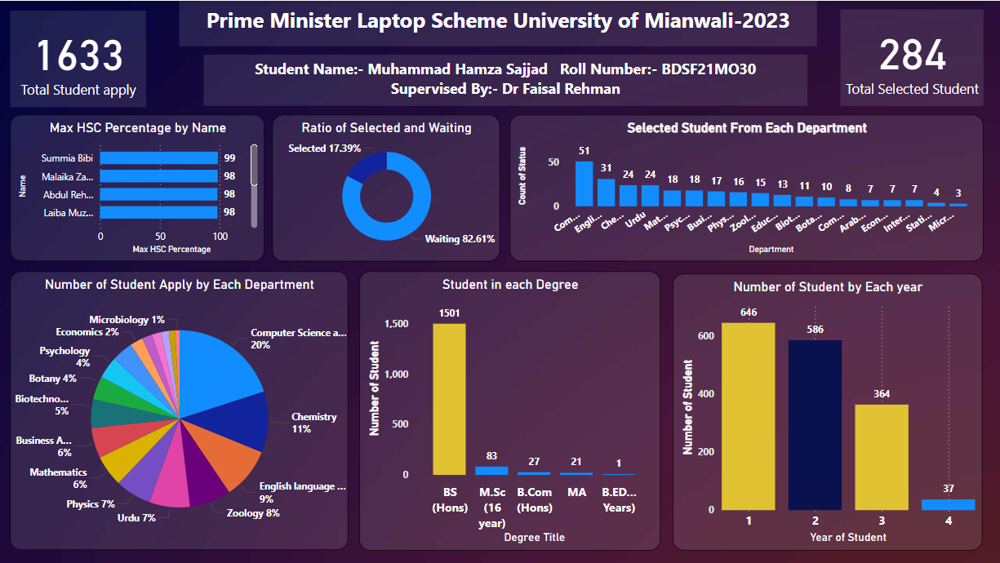

# Prime Minister Laptop Scheme – Power BI Dashboard

This Power BI project analyzes student applications and selections under the
Prime Minister Laptop Scheme (University of Mianwali – 2023).

## Dashboard Highlights
- Total students applied vs selected
- Department-wise applications and selections
- Degree-wise student distribution
- Year-wise student analysis
- Selection vs waiting ratio
- Top students by HSC percentage

## Tools Used
- Power BI Desktop
- Power Query
- DAX

## Dashboard Preview

## Author
Muhammad Hamza Sajjad  
BS Data Science  
University of Mianwali
